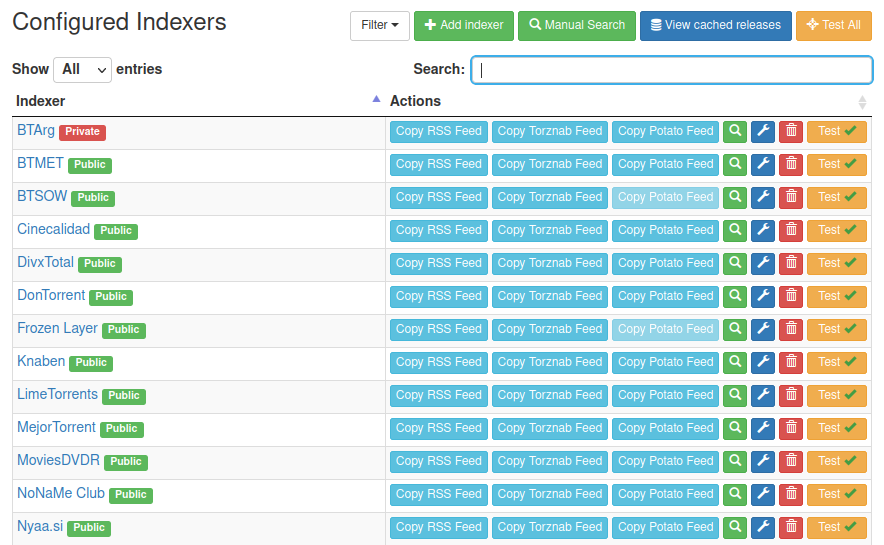
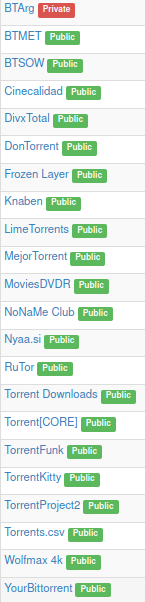
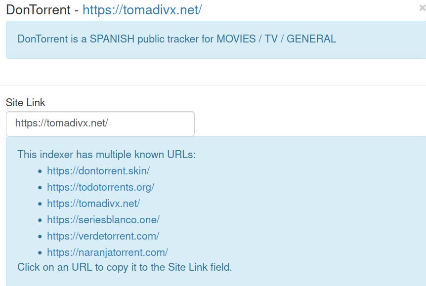
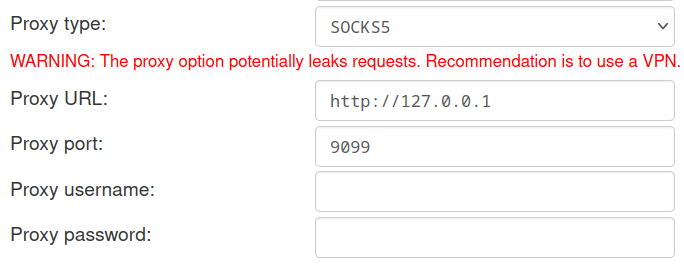
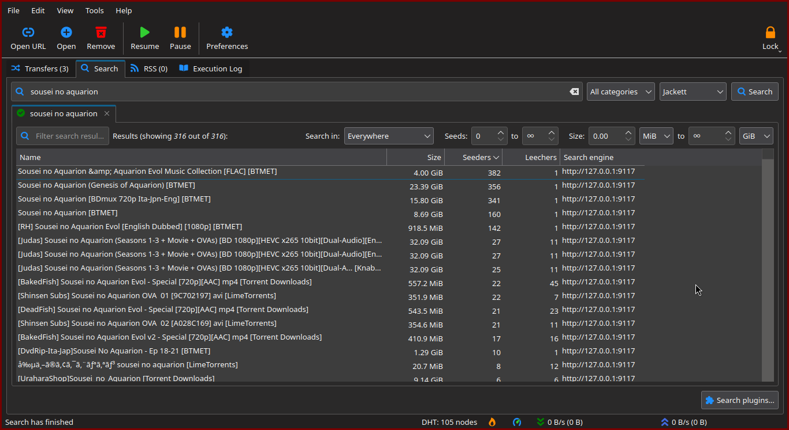

This article is about how to simplify the work
with torrents with the help of the `Jackett` aggregator,
the open source torrent client `qBittorrent`
and `btstrm`, the program for directly streaming torrents.

****

## Rationale

Despite the fact that many people are aware of BitTorrent technology,
they rarely make optimal use of the opportunities provided.
Let's say a person wants to download a certain movie and goes looking for it on torrent trackers.
After looking through 5 pages in the search engine,
the user finds the right movie in the right quality.
He downloads the torrent file,
switches the window of his favorite torrent client,
looks at ads,
pastes the link in the window,
selects the desired folder and waits.
Half an hour waits,
an hour waits,
finally the movie is downloaded and the user turns it on.
Notice how many actions there are?
What if you reduce them to just three &mdash
open the program, enter the title, press Enter.
Let's explore how.

## Jackett

[Jackett](https://github.com/Jackett/Jackett)
is a free/libre torrent aggregator.
It offers convenient integration with multiple programs through a single API.
This tool is indispensable for those who want to simplify the process
of searching torrents from various sources.
Using Jackett,
users can easily facilitate the process of searching dozens of trackers simultaneously,
making it essential for someone who doesn't want to waste their time.

## Installing Jackett

Before proceeding with the Jackett installation,
ensure your system meets the following requirements:

- Arch Linux or Arch-based system (Manjaro, EndeavorOS, etc.) with up-to-date packages.
- Access to the root user (`sudo`, `doas`, etc.).
- An active internet connection.

There are two ways to install Jackett.
You can use either the AUR or the Chaotic repository.

### Installing Jackett from the AUR

With `yay`, `paru`, `trizen` or any other AUR helper installed,
proceed to install Jackett by running:

```bash
yay -Syu jackett
```

This command fetches and installs Jackett,
handling dependencies automatically.
During the installation process,
you may be prompted to review the package details and confirm the installation steps.

### Installing Jackett from Chaotic-AUR

You can also install `Jackett` via Chaotic-AUR.
Detailed instructions on adding the Chaotic-AUR can be
found on its [official website](https://aur.chaotic.cx/) or the Arch Linux wiki.

Once the repository is set up,
install Jackett using the following pacman command:

```bash
sudo pacman -Syu jackett
```

## Configuration

Upon successful installation, it's crucial to configure Jackett
to run as a background service using systemd.
This ensures Jackett remains active,
ready to manage your torrent searches efficiently.

To run Jackett
and have it start automatically at boot
enable and start the systemd service by executing:

```bash
sudo systemctl enable --now jackett
```

This command activates the Jackett service
and ensures its automatic startup in future system reboots,
offering a hassle-free user experience.

### Verifying the Installation

Verify that Jackett is running correctly
by accessing its web interface through your preferred web browser.
Navigate to http://localhost:9117 to open the Jackett dashboard,
where you can begin configuring your torrent sources and preferences.
You should see this dashboard (without predefined trackers though):



### Customizing Jackett

Before you start using Jackett,
you should add some trackers to it.
This part of the article will cover the main ones
and explain which ones you should add first.

### Accessing Jackett's User Interface

Open the Jackett web interface.
This is accomplished by navigating to http://localhost:9117 in your web browser.
Here, Jackett's dashboard presents a user-friendly environment for managing your torrent indexers.

### Adding New Torrent Indexers

To extend your search capabilities,
Jackett allows for the easy addition of new torrent indexers:

1. **Navigating to Indexer Addition**.
   Within the Jackett UI,
   locate and click on the `+ Add Indexer` button.
   This action reveals a comprehensive list of supported torrent indexers,
   reflecting a wide array of content preferences and needs:

   

2. **Selection of Preferred Indexers**.
   From the presented list, select the
   torrent indexers (websites that collect torrent metadata) you wish to add.
   Jackett supports a diverse selection, including, but not limited to:

   ```
   BTMET, BTSOW, Knaben, LimeTorrents, Torrent Downloads, Torrent[CORE],
   TorrentFunk, TorrentKitty, TorrentProject2, Torrents.csv, YourBittorrent
   ```

   For Japanese language learners, specialized trackers are also supported:

   ```
   Nyaa.si, JPTV, AnimeBytes, AnimeTosho, Jpopsuki, ...
   ```

   Author of this article learns Spanish, so he uses these trackers:

   

### Ensuring Indexer Functionality

After the addition of your chosen trackers,
it is paramount to verify their operational status:

Click on the `Test All` button to initiate a comprehensive test of all added
trackers. This process identifies any trackers facing connectivity or
functionality issues:


### Troubleshooting Tracker Issues

Encountering errors during the testing phase? Two primary avenues exist for
resolution:

1. **Adjusting Tracker URLs**. If a tracker exhibit issues, attempt to modify
   its URL by clicking the wrench icon next to the problematic tracker. This
   interface often lists alternative mirrors, obviating the need for manual search:

   

2. **Using Proxy Services**. Utilizing proxy services can circumvent
   tracker accessibility issues. Arch Linux users can integrate SOCKS5 or HTTP
   proxies using tools like `xray` or `v2ray`, complemented by user-friendly
   frontends such as `v2raya` or `nekoray`.
   Nekoray can be [installed from the AUR](https://aur.archlinux.org/packages/nekoray).
   Afterwards,
   use resources like [asakura42/vss](https://github.com/asakura42/vss) to find proxy lists.
   You can set up your proxy at the bottom of the Jackett's Dashboard:

   

## Enhancing Torrent Management and Streaming

Now you set up your own torrent indexer.
Let's connect it to various torrent software.
In this guide, we'll cover `qBittorrent` and `btstrm`.

### A) Integrating Jackett into qbittorrent

Jackett's compatibility extends beyond traditional "Media Server" applications
to include native torrent clients like `qBittorrent`, renowned for its lightweight
footprint and rich feature set. Here's how to integrate these tools:

1. **Installation of qbittorrent:**

   Begin by installing qbittorrent on your Arch Linux system. Leverage the AUR
   for a straightforward installation process:

   ```bash
   yay -S qbittorrent
   ```

   Ensure that your system is up-to-date to avoid any potential dependency
   issues during the installation.

2. **Configuring the Jackett Plugin for qbittorrent:**

   The integration process involves configuring qbittorrent to utilize Jackett
   for an enhanced search experience across multiple torrent sources. Detailed
   instructions are available on GitHub, which outline the steps to configure
   the Jackett plugin within qbittorrent:

   - Visit the guide at [GitHub - How to configure Jackett
     plugin](https://github.com/qbittorrent/search-plugins/wiki/How-to-configure-Jackett-plugin).
   - Follow the provided step-by-step instructions carefully. The guide includes
     various scenarios you might encounter during the setup, ensuring a smooth
     configuration process.

After all, you may search all defined trackers via the `Search` ability of
`qBittorrent`:



### B) Direct Streaming with btstrm

For those who prioritize immediacy and conservation of local storage, [**btstrm**](https://github.com/asakura42/btstrm)
offers a compelling solution. This tool facilitates the direct streaming of
media from torrents, eliminating the need for full downloads.

1. **Acquiring btstrm:**

   btstrm is accessible via PyPI, allowing for easy installation using pipx,
   which isolates Python packages in their own environments. If pipx is not
   already installed on your system, you can install it first:

   ```bash
   sudo pacman -S python-pipx
   pipx ensurepath
   ```

   Subsequently, install btstrm using pipx:

   ```bash
   pipx install btstrm
   ```
2. **Installing dependencies**:

   Before using btstrm, ensure that you have the following dependencies installed:

   ```
   mpv
   btfs
   fzf
   chafa
   ```

   You can install them by running:

   ```bash
   sudo pacman -Syu --needed mpv btfs fzf chafa
   ```

   [impd](passive-listening.html#impd) is optional dependency,
   but it is [highly recommended for language learners](passive-immersion.html).

   Another optional dependency is
   [osd](https://github.com/druidamix/Opensubtitles-downloader) - `btstrm`
   uses it to download subs from opensubtitles with `-s` flag.

3. **Config editing:**

   After installing `btstrm` and dependencies, run btstrm once - it will create config
   file `btstrm.conf` in `~/.config` directory. Or you may add it manually:

   ```
   [DEFAULT]
   LANG = es-ES
   JACKETT_API_KEY = your_jackett_api_key
   JACKETT_URL = http://127.0.0.1:9117
   TIMEOUT=30
   REMOVE_PLAYED_FROM_LIST = True
   ```

5. **Using btstrm for Streaming:**

   With btstrm installed, you can now stream media from torrents directly. Just
   run it as `btstrm "shingeki no kyojin"` or smth like that.
   Refer to [README](https://github.com/asakura42/btstrm#btstrm---bittorrent-streaming-program)
   for further instructions.

## Comparison Between Various Torrent-based Software

This table presents a snapshot of how `btstrm`, `WebTorrent`, media server
software, and traditional downloading compare across various aspects relevant to
users looking to stream or download media content. `btstrm` offers a unique
niche for users who prefer a command-line interface and the efficiency of
streaming without the necessity of a full download, integrating neatly with
torrent search tools like Jackett. In contrast, `WebTorrent` bridges torrenting
with web technologies for easy browser-based streaming. Media server options
like Plex or Jellyfin provide a comprehensive solution for those wanting to
organize and stream a personal media library across devices, with advanced
features such as metadata management and transcoding. Traditional downloading
remains the simplest form, focusing on file ownership and offline access without
the complexities of streaming or media management.

| Feature/Aspect                                  | btstrm                                                                                                                                                                                                    | WebTorrent                                                    | Media Server (e.g., Plex, Jellyfin)                                                                                                 | Downloading                               |
|-------------------------------------------------|-----------------------------------------------------------------------------------------------------------------------------------------------------------------------------------------------------------|---------------------------------------------------------------|-------------------------------------------------------------------------------------------------------------------------------------|-------------------------------------------|
| **Primary Use**                                 | Streaming torrents directly from the command line                                                                                                                                                         | Streaming torrents from command line or via desktop app       | Organizing and streaming media from a personal server                                                                               | Downloading files to local storage        |
| **Key Features**                                | - Direct streaming without full download<br>- Jackett integration<br>- Movie titles and posters from TMDB<br>- Interactive selection with fzf<br>- Automatic media player detection<br>- Subtitle support | - Browser-based streaming<br>- Peer-to-peer streaming<br>     | - Rich media organization<br>- Streaming to various devices<br>- Extensive metadata and library management<br>- User access control | - Full file ownership<br>- Offline access |
| **Setup Complexity**                            | Moderate (requires several dependencies and configuration)                                                                                                                                                | Low to Moderate (simpler setup, browser-based or desktop app) | High (requires server setup and configuration)                                                                                      | Low (simple download and open)            |
| **Integration with Torrent searching software** | Yes                                                                                                                                                                                                       | No (not directly, relies on torrent files or magnet links)    | Via plugins or third-party apps                                                                                                     | Via plugins                               |
| **Hardware Requirements**                       | Low (runs on minimal hardware)                                                                                                                                                                            | Moderate (depends on usage in browser or desktop app)         | Moderate to High (depends on server and streaming quality)                                                                          | Low                                       |
| **Flexibility**                                 | High (command line-based, customizable)                                                                                                                                                                   | Low                                                           | High (extensive customization and plugins)                                                                                          | Moderate (depends on program)             |
| **Streaming Capability**                        | Immediate streaming                                                                                                                                                                                       | Immediate streaming                                           | Organized library streaming with transcoding options                                                                                | Not applicable (requires download)        |
| **Language Learning Tools**                     | Integration with `impd` for language immersion                                                                                                                                                            | Not applicable                                                | Not directly, though plugins may add functionality (dunno)                                                                          | Not applicable                            |
| **Subtitle Support**                            | Automatic subtitle search and download                                                                                                                                                                    | Manual search and download                                    | Comprehensive subtitle management                                                                                                   | Manual search and download                |
| **User Interface**                              | Command line                                                                                                                                                                                              | Command-line interface or desktop app                         | Polished web interface                                                                                                              | Varies with torrent client                |
| **Content Organization**                        | Manual (through command line options)                                                                                                                                                                     | Manual or automatic based on app                              | Automatic (with rich metadata and categorization)                                                                                   | Manual (depends on user's system)         |
| **Seeding Capability**                          | While streaming                                                                                                                                                                                           | Yes, but with caveats                                         | Yes (via plugins)                                                                                                                   | Yes                                       |
| **Dependencies**                                | Python, media players (mpv, vlc), fzf, btfs, Jackett, osd ...                                                                                                                                             | Media player or specific desktop app dependencies             | Server software, possibly transcoding software                                                                                      | Torrent client                            |
| **Mobile Support**                              | Through SSH or remote command execution                                                                                                                                                                   | Directly via web or through apps                              | Native apps or web interface                                                                                                        | Depends on torrent client                 |
| **Data Storage**                                | `~/.cache` directory                                                                                                                                                                                      | `/tmp` (not changeable)                                       | Any directory                                                                                                                       | Any directory                             |


## Conclusion

Concluding from the comparison above, the combination of `Jackett` with `qbittorrent` and `btstrm`
emerges as an exceptionally streamlined and efficient solution for users aiming
to search and stream torrents, particularly those with a focus on language
learning. This trio leverages the robust torrent search capabilities of
`Jackett`, integrating seamlessly with btstrm's direct streaming functionality,
to offer a compelling user experience that is both powerful and user-friendly.

The integration of `Jackett` allows users to aggregate torrent searches from
multiple indexers into a single, unified interface, significantly simplifying
the process of finding content. This is particularly beneficial for language
learners who may be looking for specific educational materials or media in
foreign languages. Once the desired content is identified, `btstrm` facilitates
immediate streaming of these torrents directly from the command line. This
eliminates the need for the entire download to complete, offering instant access
to language learning materials and foreign language media. Moreover, `btstrm`'s
ability to **fetch movie titles and posters from The Movie Database (TMDB)**,
along with its interactive selection process using `fzf`, enhances the user's
ability to find and choose the most relevant content for their learning journey.

Additionally, `btstrm` stands out for its **support for language learning
tools**, such as the integration with `impd` for language immersion. This
feature is invaluable for learners looking to immerse themselves in their target
language through media. The **automatic subtitle searching** functionality using
`osd` via opensubtitles further complements this by easing the acquisition of
necessary language subtitles, thereby enriching the learning experience.

In summary, for those in the pursuit of an easy, efficient way to search and
stream torrents, especially with an eye towards language learning, the synergy
between `Jackett` and `btstrm` or `qBittorrent` is unbeatable. It not only
simplifies the process of finding and accessing content but does so in a way
that enriches the user's learning experience, making it the optimal choice in a
landscape of more complex or less integrated solutions.
